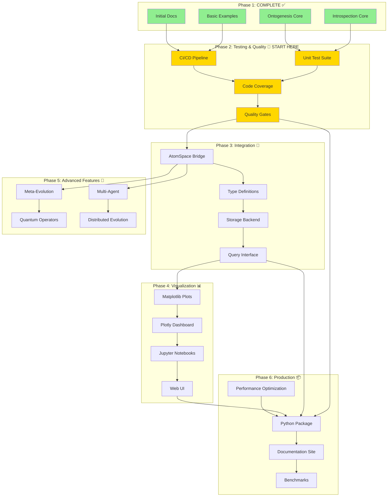
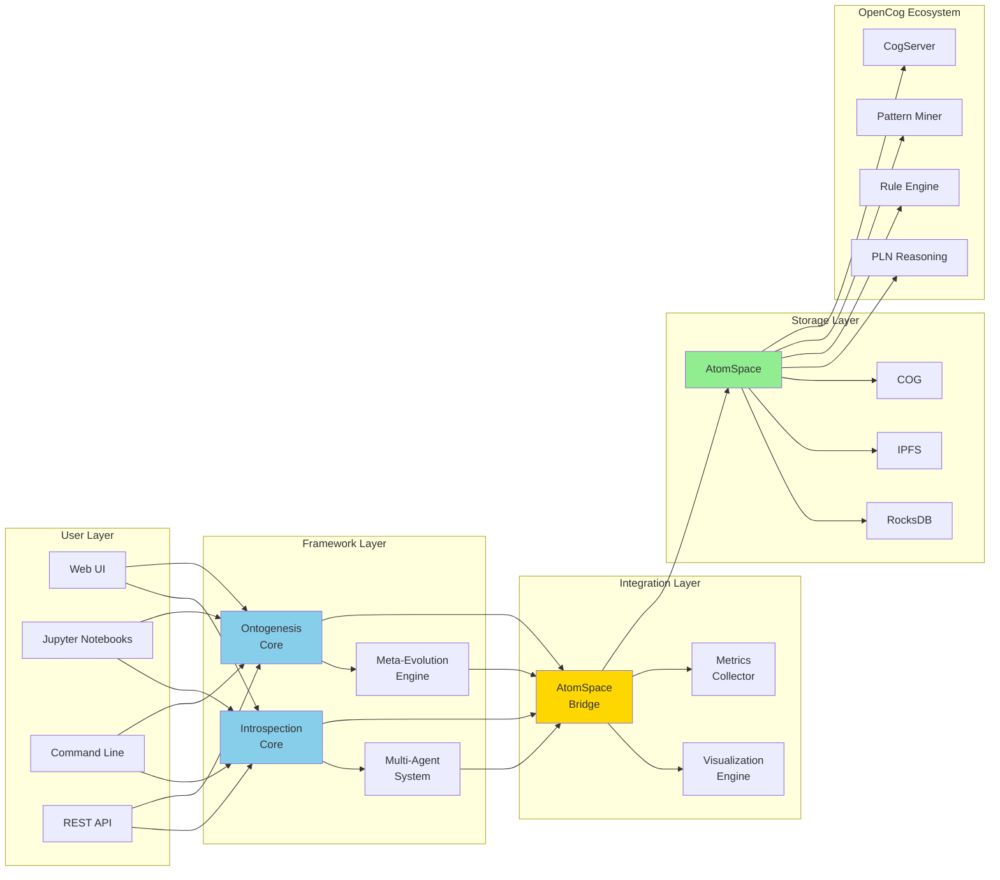
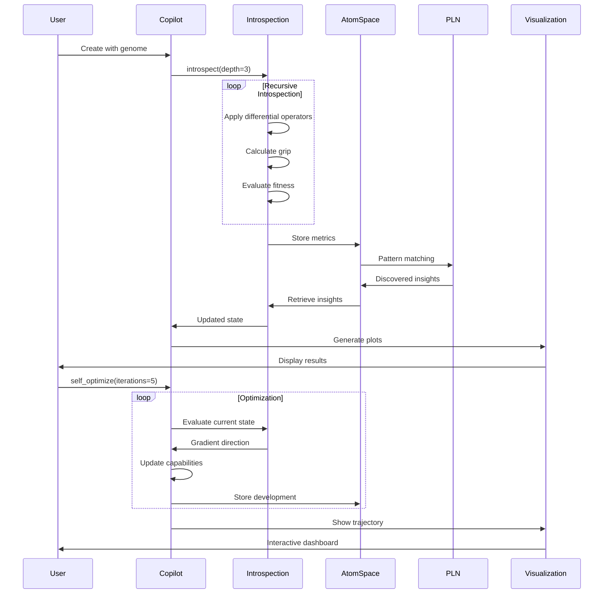
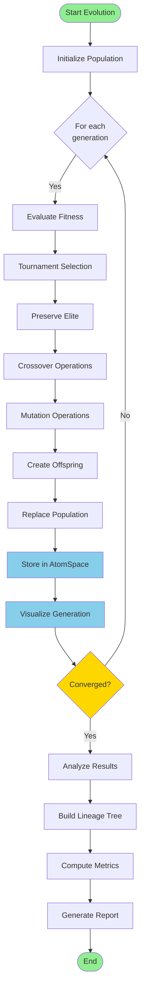
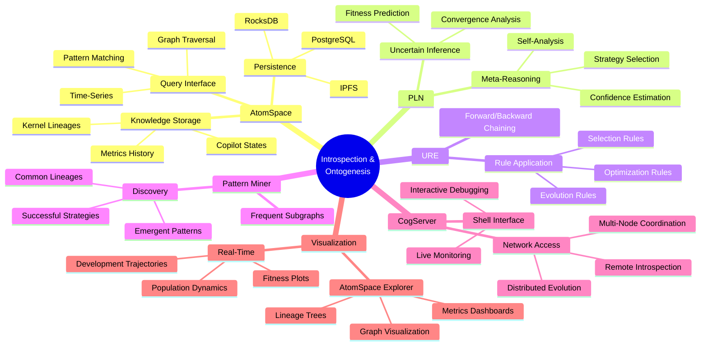
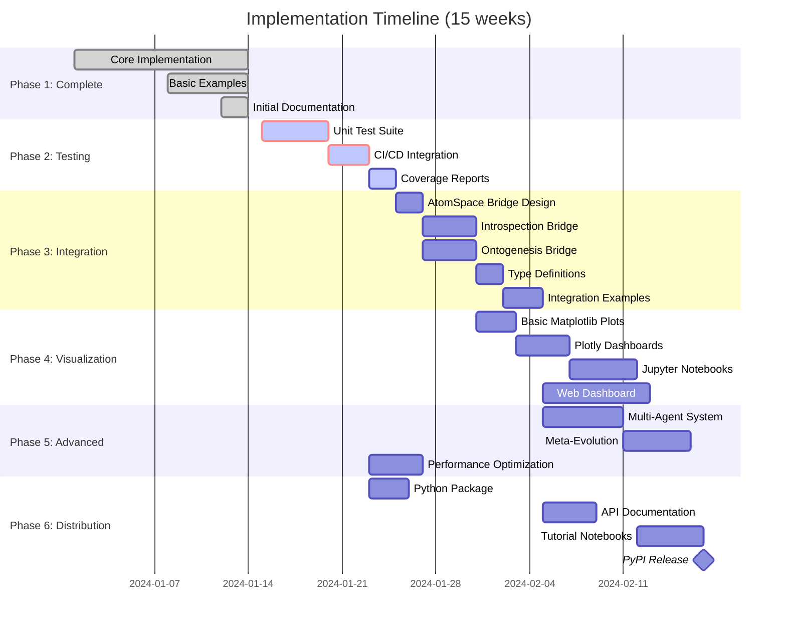
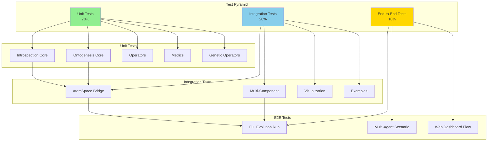
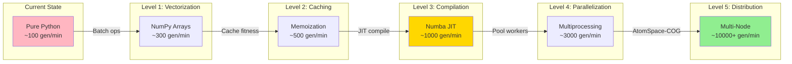

# Implementation Roadmap - Visual Guide

## Architecture Evolution



## System Architecture



## Data Flow



## Evolution Pipeline



## Integration Points with OpenCog



## Priority Dependencies



## Testing Strategy



## Performance Optimization Path



## Feature Dependency Matrix

| Feature | Depends On | Blocks | Priority | Status |
|---------|-----------|--------|----------|--------|
| **Unit Tests** | Core Implementation | CI/CD, Package | CRITICAL | 🎯 Next |
| **CI/CD** | Unit Tests | Package, Docs | CRITICAL | 🎯 Next |
| **AtomSpace Bridge** | Core, Tests | PLN Integration, Distributed | HIGH | 📋 Planned |
| **Visualization** | Core | Web Dashboard | HIGH | 📋 Planned |
| **Multi-Agent** | AtomSpace Bridge | Distributed | MEDIUM | 📋 Planned |
| **Meta-Evolution** | Ontogenesis Core | Research | MEDIUM | 📋 Planned |
| **Web Dashboard** | Visualization, AtomSpace | Production | MEDIUM | 📋 Planned |
| **Python Package** | CI/CD | PyPI Release | MEDIUM | 📋 Planned |
| **Performance Opt** | Tests | Distributed | MEDIUM | 📋 Planned |
| **Documentation** | All Features | Community Adoption | HIGH | 🚧 In Progress |

## Success Metrics Dashboard

```
┌─────────────────────────────────────────────────────────────┐
│                    PROJECT HEALTH                           │
├─────────────────────────────────────────────────────────────┤
│                                                             │
│  Code Quality              Performance                      │
│  ├─ Test Coverage:  0%    ├─ Gen/Min:     100             │
│  ├─ Type Coverage: 60%    ├─ Memory:      50MB            │
│  ├─ Linting:       ✓      └─ Scalability: 100 kernels     │
│  └─ Security:      ✓                                        │
│                                                             │
│  Integration               Community                        │
│  ├─ AtomSpace:     0%     ├─ GitHub Stars:  TBD           │
│  ├─ PLN:           0%     ├─ Contributors:  1             │
│  ├─ Visualization: 0%     ├─ Issues:        0             │
│  └─ CogServer:     0%     └─ PRs:           0             │
│                                                             │
│  Documentation            Research                          │
│  ├─ API Docs:     40%     ├─ Papers:        0             │
│  ├─ Tutorials:    20%     ├─ Citations:     0             │
│  ├─ Examples:     60%     ├─ Use Cases:     3             │
│  └─ Guides:       50%     └─ Benchmarks:    0             │
│                                                             │
└─────────────────────────────────────────────────────────────┘

Target Milestones:
🎯 Week 1:  Test Coverage 70%, CI/CD Active
🎯 Week 3:  AtomSpace Integration 50%
🎯 Week 6:  Visualization Dashboard Live
🎯 Week 10: Python Package on PyPI
🎯 Week 15: Research Paper Submitted
```

---

## Quick Reference

### Start Here
```bash
# 1. Run existing examples to understand the system
cd opencog-org
python3 examples/introspection/basic_introspection.py
python3 examples/ontogenesis/self_generation.py

# 2. Create test structure
mkdir -p tests
touch tests/__init__.py tests/test_introspection.py

# 3. Write first test
# See NEXT_STEPS.md section 1.1 for details

# 4. Set up CI
# See NEXT_STEPS.md section 1.2 for details
```

### Key Files
- **Implementation**: `IMPLEMENTATION_SUMMARY.md` - What exists
- **Analysis**: `INTROSPECTION_REPORT.md` - Repository state
- **Roadmap**: `NEXT_STEPS.md` - Detailed plan (full version)
- **Quick Guide**: `docs/ROADMAP_SUMMARY.md` - Quick reference
- **Visual Guide**: `docs/ROADMAP_DIAGRAMS.md` - This file

### Resources
- Core Code: `introspection/`, `ontogenesis/`
- Examples: `examples/`
- Agent Specs: `.github/agents/introspection.md`, `.github/agents/ONTOGENESIS.md`

---

**Ready to contribute?** Start with the testing phase and work your way through the roadmap! 🚀
