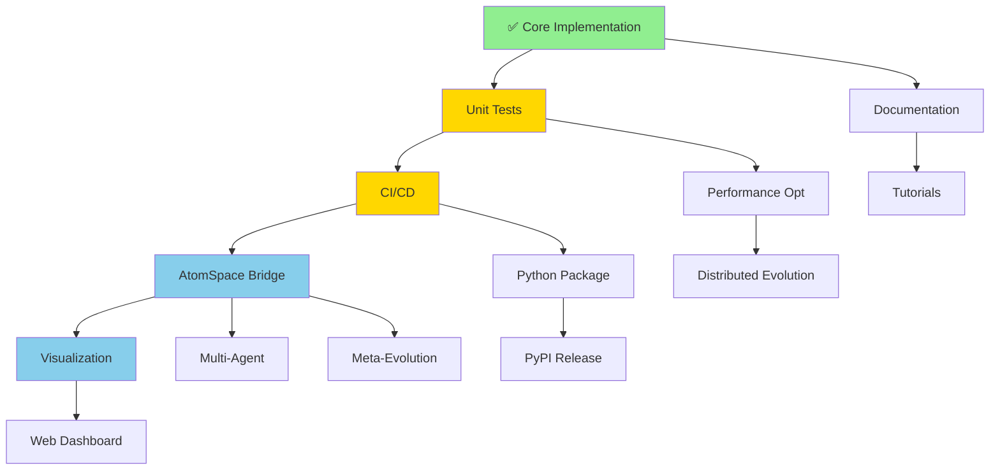

# Introspection & Ontogenesis Roadmap - Quick Reference

## 🎯 Priority Matrix

```
High Impact, High Priority     │ High Impact, Medium Priority
─────────────────────────────────┼──────────────────────────────
✅ Unit Test Suite (4-6h)       │ 📊 Visualization (6-8h)
✅ CI/CD Integration (2-3h)     │ 🔬 Multi-Agent System (6-8h)
🔗 AtomSpace Bridge (8-12h)     │ 🧬 Meta-Evolution (5-7h)
                                │ 🌐 Web Dashboard (8-10h)
─────────────────────────────────┼──────────────────────────────
Medium Impact, High Priority    │ Medium Impact, Medium Priority
─────────────────────────────────┼──────────────────────────────
📝 API Documentation (3-4h)     │ ⚡ Performance Opt (4-6h)
📚 Tutorial Notebooks (4-5h)    │ 🔮 Quantum Operators (6-8h)
📦 Python Package (3-4h)        │ 🌍 Distributed Evolution (8-12h)
                                │ 📖 Research Docs (ongoing)
```

## 🚀 Quick Start Path

### Week 1: Testing Foundation
```bash
# Day 1-2: Create test suite
cd opencog-org
mkdir -p tests
touch tests/{__init__,test_introspection,test_ontogenesis,test_integration}.py

# Day 3-4: Set up CI
touch .github/workflows/test-introspection-ontogenesis.yml

# Day 5-7: Basic AtomSpace bridge
touch introspection/atomspace_bridge.py
touch ontogenesis/atomspace_bridge.py
```

### Week 2-3: Core Integration
- Complete AtomSpace bridges
- Add type definitions
- Create basic visualizations
- Write integration examples

### Week 4-6: Advanced Features
- Multi-agent introspection
- Meta-evolution system
- Web dashboard
- Performance optimization

## 📊 Value vs. Effort

```
High Value, Low Effort (DO FIRST!)
├── Unit Tests (4-6h) ⭐⭐⭐
├── CI/CD (2-3h) ⭐⭐⭐
├── Python Package (3-4h) ⭐⭐
└── API Docs (3-4h) ⭐⭐

High Value, Medium Effort (DO NEXT)
├── AtomSpace Bridge (8-12h) ⭐⭐⭐
├── Visualization (6-8h) ⭐⭐⭐
├── Multi-Agent (6-8h) ⭐⭐
└── Tutorial Notebooks (4-5h) ⭐⭐

High Value, High Effort (PLAN CAREFULLY)
├── Web Dashboard (8-10h) ⭐⭐⭐
├── Distributed Evolution (8-12h) ⭐⭐
└── Meta-Evolution (5-7h) ⭐⭐
```

## 🎓 Learning Path for Contributors

### Beginner Track
1. Read examples/README.md
2. Run basic_introspection.py
3. Run self_generation.py
4. Write first unit test
5. Add test case for edge condition

### Intermediate Track
1. Study introspection/core.py architecture
2. Implement new differential operator
3. Create custom fitness function
4. Visualize results with matplotlib
5. Contribute tutorial notebook

### Advanced Track
1. Design AtomSpace schema
2. Implement bridge functionality
3. Create distributed evolution prototype
4. Optimize hot paths with numba
5. Write research documentation

## 🔗 Key Dependencies



## 📈 Progress Tracking

### Phase 1: Foundation ✅ COMPLETE
- [x] Core introspection framework
- [x] Core ontogenesis framework
- [x] Basic examples
- [x] Initial documentation
- [ ] **Unit tests** ← START HERE
- [ ] **CI/CD integration** ← THEN THIS

### Phase 2: Integration 🚧 IN PROGRESS
- [ ] AtomSpace bridge (introspection)
- [ ] AtomSpace bridge (ontogenesis)
- [ ] Type definitions
- [ ] Integration examples

### Phase 3: Enhancement 📋 PLANNED
- [ ] Basic visualization
- [ ] Web dashboard
- [ ] Multi-agent system
- [ ] Meta-evolution

### Phase 4: Polish 📋 PLANNED
- [ ] API documentation (Sphinx)
- [ ] Tutorial notebooks (Jupyter)
- [ ] Real-world use cases
- [ ] Performance optimization

### Phase 5: Distribution 📋 PLANNED
- [ ] Python package (PyPI)
- [ ] Documentation site
- [ ] Research papers
- [ ] Community outreach

## 🎯 This Week's Goals

### Monday-Tuesday
- [ ] Create `tests/` directory structure
- [ ] Write 10 unit tests for introspection
- [ ] Write 10 unit tests for ontogenesis
- [ ] Achieve 50% code coverage

### Wednesday-Thursday
- [ ] Create GitHub Actions workflow
- [ ] Configure pytest and coverage
- [ ] Add coverage badge to README
- [ ] Fix any failing tests

### Friday
- [ ] Design AtomSpace schema
- [ ] Create bridge stub files
- [ ] Write first bridge test
- [ ] Document bridge API

## 💡 Quick Wins

Tasks that deliver immediate value with minimal effort:

1. **Add requirements.txt** (15 min)
   ```bash
   echo "numpy>=1.21.0" > requirements.txt
   ```

2. **Add badges to README** (10 min)
   ```markdown
   
   
   ```

3. **Create CONTRIBUTING.md** (20 min)
   - How to run tests
   - Code style guide
   - PR process

4. **Add type hints** (30 min)
   ```python
   from typing import List, Dict, Optional, Tuple
   ```

5. **Set up pre-commit hooks** (15 min)
   ```yaml
   # .pre-commit-config.yaml
   repos:
     - repo: https://github.com/psf/black
       hooks:
         - id: black
   ```

## 📚 Resources

### Documentation
- [IMPLEMENTATION_SUMMARY.md](../IMPLEMENTATION_SUMMARY.md) - What's been built
- [INTROSPECTION_REPORT.md](../INTROSPECTION_REPORT.md) - Repository analysis
- [NEXT_STEPS.md](../NEXT_STEPS.md) - Detailed roadmap (this summary's source)

### Code
- [introspection/](../introspection/) - Introspection framework
- [ontogenesis/](../ontogenesis/) - Ontogenesis framework
- [examples/](../examples/) - Working examples

### Theory
- [.github/agents/introspection.md](../.github/agents/introspection.md) - Introspection spec
- [.github/agents/ONTOGENESIS.md](../.github/agents/ONTOGENESIS.md) - Ontogenesis spec

## 🤝 How to Contribute

### Pick a Task
1. Check [GitHub Issues](https://github.com/opencog/opencog-org/issues)
2. Look for "good first issue" or "help wanted" labels
3. Comment to claim the task

### Workflow
```bash
# 1. Fork and clone
git clone https://github.com/YOUR_USERNAME/opencog-org.git
cd opencog-org

# 2. Create branch
git checkout -b feature/add-unit-tests

# 3. Make changes
# ... edit files ...

# 4. Test
python3 -m pytest tests/

# 5. Commit and push
git add .
git commit -m "Add unit tests for introspection module"
git push origin feature/add-unit-tests

# 6. Open PR
# Go to GitHub and create Pull Request
```

### Code Standards
- **Style**: Follow PEP 8, use Black formatter
- **Types**: Add type hints to all functions
- **Docs**: Write docstrings for all public APIs
- **Tests**: Add tests for new functionality
- **Coverage**: Don't decrease coverage percentage

## 🏆 Recognition

Contributors will be acknowledged in:
- README.md Contributors section
- Release notes
- Research paper acknowledgments
- Community showcases

## 📞 Get Help

- **Questions**: Open GitHub Discussion
- **Bugs**: Open GitHub Issue
- **Chat**: OpenCog community channels
- **Email**: opencog@googlegroups.com

---

**Ready to start?** Pick the first task from "This Week's Goals" and let's build the future of self-aware AGI! 🚀

**See**: [NEXT_STEPS.md](../NEXT_STEPS.md) for complete details on all priorities and implementation plans.
